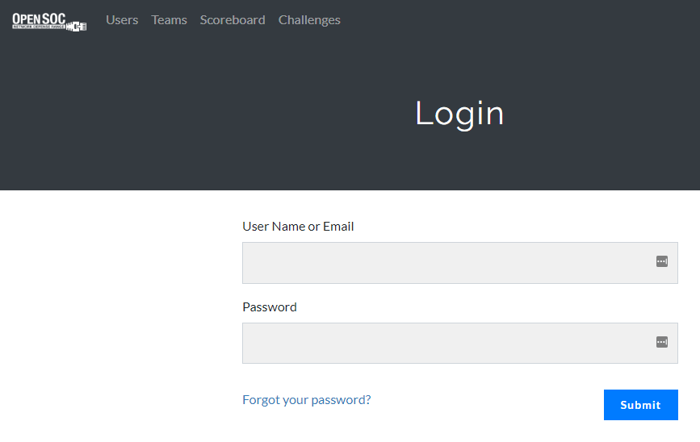
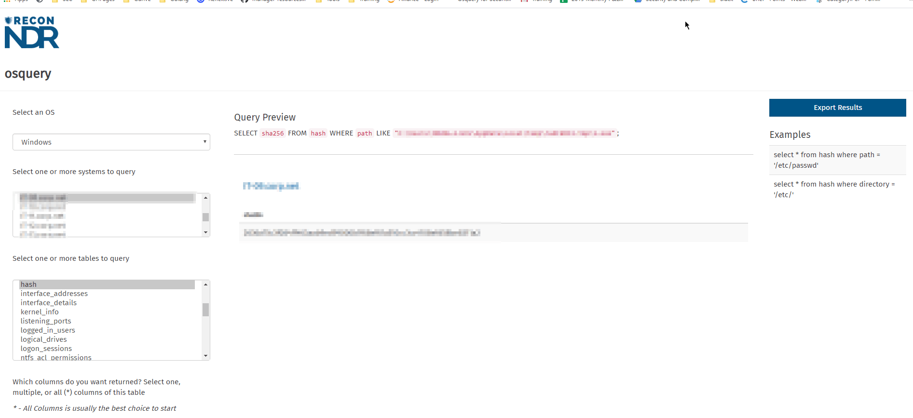

So Thursday (April 9th) I participated in an online blue team defense simulation event, known as OpenSOC.

What follows is:
* What the event is
* How I found out about the event
* The Event and my Experience
* Things I learned
* how the event was run
* How an IR course I took in December helped

# What is OpenSOC?
According to their website found here: https://opensoc.io/
> OpenSOC is a blue team defense simulation that is as close to "the real thing" as it gets. This isn’t just another CTF. We’ve built this platform to train real-world responders to handle real-world situations. Our environment is a highly portable, fully functional replication of an enterprise environment, complete with all the trimmings - Active Directory, Exchange, distributed networks, various sensors, log aggregation, end-user simulation, and more.
>
> OpenSOC is comprised of over a dozen open source projects, including the below.

The tools they list are what you would think of:  
* Metasploit
* Osquery
* Snort
* pfsense
* Graylog
* Suricata

\+ others

screenshot from the  OpenSoc website.

# How I found out about the event?
Twitter... Seriously twitter!

A post came across my feed asking for interested. I responded and apparently so did enough people that we had 700 people during the event.

Sign up was here:  

Twitter is great:  

# The Event And My Experience

## My preparation
I had once participated in ProsvJoes CTF at BsidesLV. As such I expected a hands on 'defense' event. 

The 3 main tools to be used were Graylog, molo-ch and OSquery. For my team, I focused on OSquery.  
  
There is a great course from "Applied Network Defense" that I had started but never finished. So I quickly ran through the usage videos to get a handle on that. The course can be found here networkdefense.io/library/osquery-for-security-analysis.

 
I had completed the eLearnSecurity Incident Responder certification exam in December (course found here: [IHRP](https://www.elearnsecurity.com/course/incident_handling_response_professional/). So I had a large list of investigating queries to use. For my exam I had them in Splunk and ELK search formats) .

So I thought it would be easy enough to convert them to Graylog. Or at least use as a reference sheet.

There were other things I did, but best not give them all away. 

## The Event
The event was not a live defense like a normal red team vs blue team event. It was a browser based blue team investigative CTF. It was amazing.

Being browser based made it much more accessible. Participants did not need a laptop that could handle a virtual machine, or RDP. They just needed something that could run a browser!

Sorry I did not get a screenshot of the Challenge page. But there were lots of challenges!

Again it was all browser based:

### The tools
Graylog was used as the SIEM.
molo-ch was for full PCAP analysis
OSquery - for endpoint visiblity

Please note, images have answers to challenges redacted (in-case they are reused)

You can see my setup in Graylog here. I added some fields to help with a challenge I was on at the time.

There was a GUI to run OSquery. I thought this was amazing because it makes it accessible to so many participants:  

A big thank you to [@shortxstack](https://twitter.com/shortxstack) who created the GUI for it. 

### Challenges
The challenges varied and required different skill sets:  
* Network Traffic Analysis
* Log correlation
* Understanding attacker methodology
* Windows & Linux experience
* Log awareness - which logs had what information
This is not a full list. I as focused on my challenges which were mostly between using Graylog, molo-ch and OSquery.

There were some memory analysis and Virtual Machines that could be downloaded as well.

### How Did My Team Do
Well.. Not great, but also not bad!
We finished 44th place out of 194 teams! Which personally is a great achievement.

Even though I had the day off work (thanks Boss!) it ended up being a busy day off the OpenSoc challenges.  I was still fortunate to smash about 6-8 hours (give or take) in the event. 

Our team consisted of Canadians:
* Me - Security Manager
* A red teamer  
* A co-op student of mine (totes pro)
* A pentester
* A Pentester

Excited to say I ended up getting the most points for the team. In hacker CTFs I have always struggled, so this was a pleasant surpise:

As other team members work slowed down, we were able to pick up more points:  

