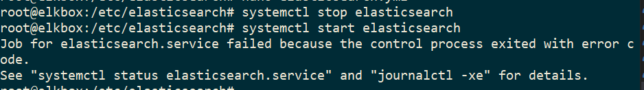

TL;DR Create Logstash conf.d file to allow Winlogbeat to be ingested into Logstash. Change Winlogbeat config file to use Logstash instead of Elasticsearch.

I had trouble installing ELK and configuring it to accept Winlogbeat, I went down a rabbit hole attempting to use Elasticsearch. This is an explanation of how to do it correctly without ELK being forced into 'production mode'.

*Production mode meaning:* All warnings become errors and if they are not resolved, Elasticsearch will [not launch](https://www.elastic.co/guide/en/elasticsearch/reference/current/system-config.html).

# Prerequisites
## ELK Installed
It is assumed that an instance of ELK has been installed and is up and running.
Follow the install guide from elastic.co [here](https://www.elastic.co/guide/en/elastic-stack/current/installing-elastic-stack.html) 
ELK should look like this, it does not need to be ingesting any logs.


### Winlogbeat Installed
Winglogbeat should also be installed, the install guide can be found [here](https://www.elastic.co/guide/en/beats/winlogbeat/current/winlogbeat-installation-configuration.html).

**ONLY FOLLOW STEP 1: INSTALL WINLOGBEAT**

The [Quick start install and configuration guide](https://www.elastic.co/guide/en/beats/winlogbeat/current/winlogbeat-installation-configuration.html) from Step 2 will use ElasticSearch, and that is not the configuration used in this post.


# Logstash The Correct Way
Not the only way, but the way that allows ingesting Winlogbeat without having to go into production mode.

The way to do this is to use [Logstash](https://www.elastic.co/Logstash).

In short:  
* Create a configuration file to have Logstash to listen for Winlogbeat
* Configure the Winlogbeat YAML file to use Logstash instead of Elasticsearch


## Logstash Processing
If you read about how Logstash works, it has a processing pipeline of inputs, filters and outputs.


### conf.d Directory
First off: A configuration file that has an input, filter (optional) and output is called a Pipeline configuration file.

Pipeline configuration files go in the `/etc/Logstash/conf.d/` directory. Explained [here](https://www.elastic.co/guide/en/Logstash/current/config-setting-files.html#settings-files)
The full path in a Linux installation is:

``` bash
/etc/Logstash/conf.d$
```


### Structure of a Pipeline Configuration File
[Structure of a Config File explanation](https://www.elastic.co/guide/en/Logstash/7.9/configuration-file-structure.html) 

Configuration examples if needed can be found [here](https://www.elastic.co/guide/en/Logstash/7.9/config-examples.html)
> Inputs generate events, filters modify them, and outputs ship them elsewhere. Inputs and outputs support codecs that enable you to encode or decode the data as it enters or exits the pipeline without having to use a separate filter.
 
This paragraph means the steps required are:
* Tell Logstash what to expect
  * in this case it will be beats on port 5044
* Add any filtering needed
  * none as ElasticSearch already knows how to parse WinlogBeats
* Output in to a format
  * in this case it will be sent to the local-host on port 9200 (ElasticSearch)
  
 

### Beats Input Plugin for Logstash
If you are new to ELK it can be quite a bit of a jump to ingesting Winlogbeat into Logstash instead of ElasticSearch.

The important thing to understand is that Winlogbeat is a type of 'Beats' and Logstash works well with them thanks to a Beat input plugin. There are many types of 'Beats', all of them are listed [here](https://www.elastic.co/beats/)

Beats can be thought of like a ready to go log forwarder that sit on the endpoint you want to receive logs from. In the case of Winlogbeat it will sit on a Windows machine and send the logs to Logstash.

### The Beats Pipeline Config file
Following along the [Beats Input Plugin Page](https://www.elastic.co/guide/en/Logstash/current/plugins-inputs-beats.html) there is a basic configuration file that ingests beats. The configuration file follows the Pipeline Configuration format mentioned above.

```bash
input {
  beats {
   port => 5044
    }
}
output {
  elasticsearch {
    hosts => ["http://localhost:9200"]
    index => "%{[@metadata][beat]}-%{[@metadata][version]}"
  }
}
```

This is used to tell Logstash to listen/ingest incoming Beats connections and to index them into Elasticsearch. 


Save this file with the extension `.conf` within the `conf.d` directory. The full directory path should be:
``` bash
/etc/Logstash/conf.d
```
Like this:  


Stop and Start Logstash, perhaps even Elasticsearch to ensure the new configuration is being used.

Logstash is now setup to ingest beats, including Winlogbeat. The next step is to configure Winlogbeat to use Logstash instead of Elasticsearch.


# Configuring Winlogbeat To Use Logstash
The YAML file will be edited to send the Winlogbeat logs to Logstash.

After following the default installation (mentioned in the Prerequisite section) Winlogbeat should be installed here:  

``` text
C:\Program Files\Winlogbeat
```

The configuration file is called:  
`winlogbeat.yml`


Edit the file and comment out (add the '#' in front) of the Elasticsearch settings, these can be found in the Elasticsearch Output section:  


The complete Elasticsearch Option Section will look like:
``` text
# ---------------------------- Elasticsearch Output ----------------------------
#output.elasticsearch:
  # Array of hosts to connect to.
  #hosts: ["localhost:9200"]

  # Protocol - either `http` (default) or `https`.
  #protocol: "https"

  # Authentication credentials - either API key or username/password.
  #api_key: "id:api_key"
  #username: "elastic"
  #password: "changeme"
```

Scroll down to the Logstash Output section and uncomment (remove the '#') settings. Be sure to change `localhost` with the IP address of the ELK box.


The complete Logstash Output Section will look like:


``` text
# ------------------------------ Logstash Output -------------------------------
output.Logstash:
  # The Logstash hosts
  hosts: ["172.16.2.31:5044"]

  # Optional SSL. By default is off.
  # List of root certificates for HTTPS server verifications
  #ssl.certificate_authorities: ["/etc/pki/root/ca.pem"]

  # Certificate for SSL client authentication
  #ssl.certificate: "/etc/pki/client/cert.pem"

  # Client Certificate Key
  #ssl.key: "/etc/pki/client/cert.key"
  ```

Stop and Start Winlogbeat to ensure the new configuration is being used.

# Finishing Up
With Logstash and Winlogbeat configured correctly, Kibana should have an index pattern of winlogbeat-<version>


Please follow the [Define your index patterns guide](https://www.elastic.co/guide/en/kibana/current/tutorial-define-index.html) and use "winlogbeat-*".


# Issue With Winlogbeat & in ElasticSearch
Elasticsearch by default only accepts data from localhost. If the network.host line in the YAML file is configured to an external address it will go into 'Production Mode':  


If Elasticsearch is started without fixing all 'warnings' it will not start and give the following error:


Viewing the logs does not give an indication of Production Mode.

However looking at the [Important System Configuration](https://www.elastic.co/guide/en/elasticsearch/reference/current/system-config.html) Documentation there is a line such as *"As soon as you configure a network setting like network.host, Elasticsearch assumes that you are moving to production and will upgrade the above warnings to exceptions. These exceptions will prevent your Elasticsearch node from starting. This is an important safety measure to ensure that you will not lose data because of a malconfigured server."*

Thus, if installing Elasticsearch as described in the Quick start and installation guide non-production systems will run into this issue.

All the settings that need to be considered include: 

