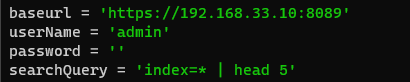

This post will cover the following:  
* Connecting to Splunk with the Python SDK, executing a search and receiving the results
* Connecting to Splunk without the SDK, using httplib and beautifulsoup

**Why this post?**
I've recently been attempting to automate actions that I do on an everyday basis. Working with Splunk on a day to day basis I thought I might try some 'automation'. 

I have code working that pulls data from Splunk and pushes it into a Google Sheet. - Not 100% sure what to do with that yet, but I was thinking some type of trend analysis.

Also, it was not easy to find the right documentation, so this is my attempt to help others that try this.


# Requirements
Splunk Enterprise, Splunk Free Enterprise, or Splunk Enterprise Installed.

**Please Note**
If this is a prod system or Splunk Enterprise, the API may not be accessible remotely. As such the code will need to be installed and executed locally on the system. - I am currently investigating how to make the API remotely accessible.

Additionally,if this is a prod system, it is best to use Oauth authentication. Some documentation can be found [here](https://docs.splunk.com/Documentation/Splunk/8.1.1/Security/UseAuthTokens)

# My home setup
Splunk Host = 192.168.1.130

Splunk license has been changed to a free licence


# Splunk SDK 
* The Splunk SDK github for python can be found [here](https://github.com/splunk/splunk-sdk-python)
* The Splunk Developer documentation can be found [here](https://dev.splunk.com/enterprise/docs/welcome). This also leads to the [Splunk Enterprise SDK for Python](https://dev.splunk.com/enterprise/docs/devtools/python)

The documentation states that :
```You can use the Splunk Enterprise SDK for Python to perform a variety of actions in Splunk Enterprise, including searching data, developing custom UIs, and managing configurations for your instance.```

So how can we connect to Splunk?

## Installing the Python SDK
If you go to the documentation page [here](https://dev.splunk.com/enterprise/docs/devtools/python/sdk-python/gettingstartedpython/installsdkpython/) for installation steps, it will suggest using pip or `setup.py`. For my Linux enviornment this would not work.

The error was:  
`ModuleNotFoundError: No module named 'splunklib'`
Googling this shows the solution is just to install the SDK and follow the documentation. I probably had my path incorrect.

Anyhow, if you run into this error, the solution for me was to clone the github repo and placed my files in there.


Like so:


Naturally, I named the file splunklib.py - due to fighting attempting to have splunklib module work.

## Connecting to splunk
The splunklib.client will be used to connect to Splunk.

Googling the [client](https://docs.splunk.com/DocumentationStatic/PythonSDK/1.1/client.html) shows:  


It is also within the Splunk Developer Documentation ["How to Connect"](https://dev.splunk.com/enterprise/docs/devtools/python/sdk-python/howtousesplunkpython/howtoconnectpython/), which is what I used to ensure my connection was working.


The example code below, will print out the app names. This is great to ensure you can connect to the Splunk API.


import splunklib.client as client

HOST = "localhost"
PORT = 8089
USERNAME = "admin"
PASSWORD = "yourpassword"

# Create a Service instance and log in 
service = client.connect(
    host=HOST,
    port=PORT,
    username=USERNAME,
    password=PASSWORD)

# Print installed apps to the console to verify login
for app in service.apps:
    print app.name
    


Once running, the code connects, authenticates and replies with the apps installed:  


**Please Note**
The above credentials will work with Enterprise Splunk and Enterprise Free Splunk.

However, if you have changed the license over to "Free Splunk", there is technically no authentication. A way to test this, is by going to you Splunk instance via the web browser and it will automatically log in. There will not be a Splunk Username and Password screen.[Information here](https://docs.splunk.com/Documentation/Splunk/8.1.1/Admin/MoreaboutSplunkFree)

As mentioned above I have the free version, so my credentials are the following:
* username of "admin"
* password of ""


## Running a Search - SDK 
So currently, the code is able to connect to Splunk and print out the Apps. How can a search be run?

Jumping to the SDK again, there is a nicely titled article that is useful. Titled: ["How to run searches and jobs using the Splunk Enterprise SDK for Python"](https://dev.splunk.com/enterprise/docs/devtools/python/sdk-python/howtousesplunkpython/howtorunsearchespython/)

There are 4 types of searches. As I just wanted to create a quick search (it does not take long to process) I opted for the One-Shot search. As explained below, the search runs immediately and returns the results once completed.

>One-shot: A one-shot search is a blocking search that is scheduled to run immediately. Instead of returning a search job, this mode returns the results of the search once completed. Because this is a blocking search, the results are not available until the search has finished.

This just allows for a search to run, without code being required that checks if the search is completed. It just waits. (Code that checks if a search is done will be shown below.)


Issues will occur if the one-shot code is copy and pasted. It does not include how to connect. The issue I found with this page was that it did not show the full code of connecting and running a search. To connect successfully, the code from above needs to be included,

The example code is:  
  


The example code and the connection code becomes the below:


**Please note**:
I changed the query to give an average of CPU used, as I have the Linux tech add-on installed. The query is the same regardless. 


#!/usr/bin/python3
from __future__ import absolute_import
from __future__ import print_function
import splunklib.client as client
import splunklib.results as results

HOST = "192.168.1.130"
PORT = 8089
USERNAME = "admin"
PASSWORD = ""

# Create a Service instance and log in
service = client.connect(
    host=HOST,
    port=PORT,
    username=USERNAME,
    password=PASSWORD)

#searches for previous day
kwargs_oneshot = {"earliest_time":"@d"}
#search being run
searchquery_oneshot = "search index=main PercentMemory=* | stats avg(PercentMemory)"
#running and storing results
oneshotsearch_results = service.jobs.oneshot(searchquery_oneshot, **kwargs_oneshot)
 # Get the results and display them using the ResultsReader
reader = results.ResultsReader(oneshotsearch_results)
for item in reader:
    print(item)
    print(item['avg(PercentMemory)'])
    



This is effectively the same query as:  


# Connecting to Splunk without the SDK
Prior to using (or finding) the Splunk SDK, I learned how to connect to Splunk with Python without the SDK.
 
 Following the [Documentation](https://docs.splunk.com/Documentation/Splunk/8.1.1/RESTTUT/RESTsearches) searches can be created with curl. With a query such as:
 ``` bash
 curl -u admin:changeme -k https://localhost:8089/services/search/jobs -d search="search *"```
 
 Then the status of the search needs to be checked to ensure it has finished:
 ``` bash
 curl -u admin:changeme -k https://localhost:8089/services/search/jobs/1258421375.19 
 ```
 
 and the results can be returned with:
 ``` bash
 curl -u admin:changeme \
     -k https://localhost:8089/services/search/jobs/1258421375.19/results/ \
     --get -d output_mode=csv
 ```
 
 
 There is even a Python example given. However this one does not search if the job is complete.


Example from the Documentation:  


from __future__ import print_function
from future import standard_library
standard_library.install_aliases()
import urllib.request, urllib.parse, urllib.error
import httplib2
from xml.dom import minidom
​
baseurl = 'https://localhost:8089'
userName = 'admin'
password = 'password'
​
searchQuery = '| inputcsv foo.csv | where sourcetype=access_common | head 5'
​
# Authenticate with server.
# Disable SSL cert validation. Splunk certs are self-signed.
serverContent = httplib2.Http(disable_ssl_certificate_validation=True).request(baseurl + '/services/auth/login',
    'POST', headers={}, body=urllib.parse.urlencode({'username':userName, 'password':password}))[1]
​
sessionKey = minidom.parseString(serverContent).getElementsByTagName('sessionKey')[0].childNodes[0].nodeValue
​
# Remove leading and trailing whitespace from the search
searchQuery = searchQuery.strip()
​
# If the query doesn't already start with the 'search' operator or another
# generating command (e.g. "| inputcsv"), then prepend "search " to it.
if not (searchQuery.startswith('search') or searchQuery.startswith("|")):
    searchQuery = 'search ' + searchQuery
​
print(searchQuery)
​
# Run the search.
# Again, disable SSL cert validation.
print(httplib2.Http(disable_ssl_certificate_validation=True).request(baseurl + '/services/search/jobs','POST',
    headers={'Authorization': 'Splunk %s' % sessionKey},body=urllib.parse.urlencode({'search': searchQuery}))[1])
    
    


### Breaking down the authentication

The base authentication information is the same again:



A request needs to be made with the username and password encoded like the following:


serverContent = httplib2.Http(disable_ssl_certificate_validation=True).request(baseurl + '/services/auth/login',
    'POST', headers={}, body=urllib.parse.urlencode({'username':userName, 'password':password}))[1]
    
    

This creates a session key, to be used when creating a search.
As such this is stored within the `sessionKey` variable like so:  


sessionKey = minidom.parseString(serverContent).getElementsByTagName('sessionKey')[0].childNodes[0].nodeValue

    


## Running the search

Once authenticated, the Session key is used along with the search query to run the search like so:


response = httplib2.Http(disable_ssl_certificate_validation=True).request(baseurl + '/services/search/jobs','POST',
    headers={'Authorization': 'Splunk %s' % sessionKey},body=urllib.parse.urlencode({'search': searchQuery}))[1]
    


This gives a simple XML response which includes the SID:


## Search for a finished Job
To identify a finished 'job' (search query) the SID of the search needs to be identified. This is seen in the screenshot above when running a search.

So, to grab this, BeautifulSoup is used.

soup = BeautifulSoup(response.decode(), 'html.parser')
searchSID=soup.response.sid.string
print("SID: ", searchSID)


Which is stored in the searchSID variable:


This SID is then searched for in the 'jobs' url path. A loop is created until the "isDone" value is found.

The jobs URL is 
``` bash
'/services/search/jobs/
```
and then the searchSID is added to create the full URL:

print(baseurl + '/services/search/jobs/' + searchSID)


A request to the server is created and executed to identify if the job has finished:

testFinish = httplib2.Http(disable_ssl_certificate_validation=True).request(baseurl + '/services/search/jobs/' + searchSID , method="GET",    headers={'Authorization': 'Splunk %s' % sessionKey})[1]



## Identifying the Finished Job
The response from searching if a job is 'done' is quite large.  
Grepping for "isDone" will show a value of 0 or 1:


``` bash
 <s:key name="isDone">1</s:key>
```

Where a value of 1 is a search is complete and results are ready. A value of 0 isthe opposite.

Having identified the tag and value needed, a for loop is created, checking every 3 seconds if the job is done.

Using beautifulSoup to identify the isDone tag can be done with:


isDone=finishCheck.find('s:key',{"name":"isDone"})




The loop looks like:

while isDone == 0:
    print("Search is not finished, waiting 3 seconds")
    time.sleep(3)
    print("Seeing if search is done")

    #parsing response#
    testFinish = httplib2.Http(disable_ssl_certificate_validation=True).request(baseurl + '/services/search/jobs/' + searchSID , method=">    headers={'Authorization': 'Splunk %s' % sessionKey})[1]
    finishCheck = BeautifulSoup(testFinish.decode(), 'lxml')
    isDoneYet=finishCheck.find('s:key',{"name":"isDone"})
    print("IS DONE RESULT: ", isDoneYet.text)
    if int(isDoneYet.text) == 1:
        isDone += 1

print("QUERY IS DONE")



The following image shows the loop in actions:  


# Collecting the Results
Once the job has been identified as complete, the results are ready to be collected.

This is simply done by requesting the job number with results:

response2 = httplib2.Http(disable_ssl_certificate_validation=True).request(baseurl + '/services/search/jobs/' + searchSID +'/results/', method="GET",    headers={'Authorization': 'Splunk %s' % sessionKey})



From this, the results can be printed:

print(response2[1].decode())


The following image shows the loop finishing and requesting the results:  


Using BeautifulSoup, the formating and information presented can be adjusted/improved.

The code in full is below, with extra print statements and comments as I was testing:

from __future__ import print_function
from future import standard_library
standard_library.install_aliases()
import urllib.request, urllib.parse, urllib.error
import httplib2
from xml.dom import minidom
import re
from bs4 import BeautifulSoup
import time
#import splunklib

baseurl = 'https://x.x.x.x:8089'
userName = 'admin'
password = ''
searchQuery = 'index=* | head 5'
# Authenticate with server.
# Disable SSL cert validation. Splunk certs are self-signed.
serverContent = httplib2.Http(disable_ssl_certificate_validation=True).request(baseurl + '/services/auth/login',
    'POST', headers={}, body=urllib.parse.urlencode({'username':userName, 'password':password}))[1]


sessionKey = minidom.parseString(serverContent).getElementsByTagName('sessionKey')[0].childNodes[0].nodeValue
# Remove leading and trailing whitespace from the search
searchQuery = searchQuery.strip()

# If the query doesn't already start with the 'search' operator or another
# generating command (e.g. "| inputcsv"), then prepend "search " to it.
if not (searchQuery.startswith('search') or searchQuery.startswith("|")):
    searchQuery = 'search ' + searchQuery
    
print("The query being run: " + searchQuery)

# Run the search.
# Again, disable SSL cert validation.
print("response to job creation:")
response = httplib2.Http(disable_ssl_certificate_validation=True).request(baseurl + '/services/search/jobs','POST',
    headers={'Authorization': 'Splunk %s' % sessionKey},body=urllib.parse.urlencode({'search': searchQuery}))[1]

soup = BeautifulSoup(response.decode(), 'html.parser')
# print(soup.prettify())
# print(soup.response.sid.string)

searchSID=soup.response.sid.string
print(searchSID)

print("===testing if finished")
print(baseurl + '/services/search/jobs/' + searchSID)


testFinish = httplib2.Http(disable_ssl_certificate_validation=True).request(baseurl + '/services/search/jobs/' + searchSID , method="GET",
    headers={'Authorization': 'Splunk %s' % sessionKey})[1]

print(testFinish[1])

finishCheck = BeautifulSoup(testFinish.decode(), 'lxml')
print(finishCheck.prettify())

print("============")
up = finishCheck.find("content")

print("==CHILDREN=")


print(finishCheck.find_all('s:key'))
print("==test")
print(finishCheck.find_all('s:key',{"name":"isDone"}))

isDone=finishCheck.find('s:key',{"name":"isDone"})
isDone = int(isDone.text)
print("IS DONE " , isDone)
print(isDone)

while isDone == 0:
    print("Search is not finished, waiting 3 seconds")
    time.sleep(3)
    print("Seeing if search is done")

    #parsing response#
    testFinish = httplib2.Http(disable_ssl_certificate_validation=True).request(baseurl + '/services/search/jobs/' + searchSID , method="GET",
    headers={'Authorization': 'Splunk %s' % sessionKey})[1]
    finishCheck = BeautifulSoup(testFinish.decode(), 'lxml')
    isDoneYet=finishCheck.find('s:key',{"name":"isDone"})
    print("IS DONE RESULT: ", isDoneYet.text)
    if int(isDoneYet.text) == 1:
        isDone += 1

print("QUERY IS DONE")
print("requesting results")

response2 = httplib2.Http(disable_ssl_certificate_validation=True).request(baseurl + '/services/search/jobs/' + searchSID +'/results/', method="GET",    headers={'Authorization': 'Splunk %s' % sessionKey})

print(response2[0].status)
print(response2[1].decode())



