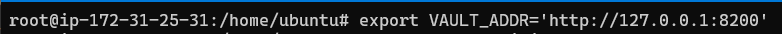

TL;DR Using short-lived secrets to access a database is much more secure than standard credentials

I recently received my AWS Solutions Architect Associate Cert, and I inadvertently  learned more about Ops, DevOps in respect to automation, deployment and most importantly secrets and access. So I wanted to share my knowledge on creating short lived credentials for database users and administrators.

In this blog post, the term Vault will be used to refer to [Hashicorp Vault](https://www.vaultproject.io/)

Please note:
- any steps I feel that are easily completed via documentation, I will refer to that. An example would be installing a Vault Dev server.

# Lab setup for this article:
* This article uses the environment from a previous blog post. If you don't have an environment setup please use that. Find it  [here](https://haydz.github.io/2021/04/24/AWS-EC2-RDS-Connection.html)
* Otherwise a single Linux server will work, it needs to have a MySQL Database installed in order to follow along.

## Itemized list:
* EC2 server with MySQL client installed
* AWS MySQL RDS
* Security Groups in AWS configured to allow the EC2 server to access teh AWS MySQL RDS

Terminology:
* Whenever the term database is used, it will be referring to the "AWS MySQL RDS Database" - I didn't want to keep typing that

This blog post will cover:
- Installing and configuring Hashicorp Vault on the EC2 instance
- Configuring Vault to connect to the MySQL server and rotate the password

# Secrets management overview (Pre tutorial)
A most common secret is a username and password, but they come in different types, such as an API key. Something that can be used to access a system, or information that requires authorization is considered a secret.

Secrets management is the process of handling secrets securely. This can include how secrets are stored, rotating them and permissions (who can access). 

Best practices in short include:  
* Centralizing secrets
* least privilege access to secrets
* dynamic short lived secrets
* auditing

This blog post will cover centralizing secrets, dynamic secrets and auditing

Secrets management is important for multiple reasons:
* the initial reason is to reduce the likelihood of secret compromise
*  better visibility into what secrets there are in the environment
    * this reduces credential creep, having lots of credentials everywhere
    * knowing who has access to what secrets
* ability to disable a secret if compromised
    * centrally storing a secret allows it to be disabled easier 
* reduction of exposure if a secret is compromised
    * without secrets management, a team may have used 1 password for multiple systems, meaning if that password is compromised it affects multiple systems. Whereas with secrets management, a secret can be per system, meaning a compromised secret would only affect one system
    
    
# Installing Vault
In this section we will walk through installing Vault. 

Official Documentation for installing server is [here](https://learn.hashicorp.com/tutorials/vault/getting-started-install?in=vault/getting-started).

Before we begin, please log into the AWS account (if you are using the Lab setup from the previous post) with the non root user:

.

Move over to the EC2 service and ensure the EC2 instance is running, if it is not, start the instance:
.

Please SSH into the instance like so:  

ssh -i "demo_key.pem" ubuntu@ec2-3-135-229-44.us-east-2.compute.amazonaws.com

Please note:
* As with any installing of Linux packages you may need to be root, so add sudo in front, or change to the root user.

Now for installing Vault we need to add the HashiCorp GPG key, the repository and then install Vault.

Select the Ubuntu/Debian tab and follow those instructions:

With the commands below:

curl -fsSL https://apt.releases.hashicorp.com/gpg | sudo apt-key add -

sudo apt-add-repository "deb [arch=amd64] https://apt.releases.hashicorp.com $(lsb_release -cs) main"

sudo apt-get update && sudo apt-get install vault


Type "vault" in the command line to confirm installation:

Congratulations Vault is installed

# Deploying Vault
We will go through a normal Vault deploy, this includes unsealing Vault.

This is not necessary, there is a Dev server that can be setup quicker. The steps for this can be found [here](https://learn.hashicorp.com/tutorials/vault/getting-started-dev-server).

For Deploying Vault, the official documentation can be found [here](https://learn.hashicorp.com/tutorials/vault/getting-started-deploy)

Vault and the configuration will be stored in a vault folder.
So according to the documentation create a vault directory with a data older inside like so:

I've created it in the Ubuntu user home directory. Just for the tutorial:


 mkdir -p vault/data


 

Create the config.hcl file in the home directory, not inside the vault directory:

 
 
 
Open config.hcl, and add the code below:

storage "raft" {
  path    = "./vault/data"
  node_id = "node1"
}

listener "tcp" {
  address     = "127.0.0.1:8200"
  tls_disable = "true"
}

api_addr = "http://127.0.0.1:8200"
cluster_addr = "https://127.0.0.1:8201"



 
Now start the server with the config file that has been created.


 vault server -config=config.hcl


 
This will start the server and should look like:  

## Initializing Vault
The same official documentation for deploying Vault covers this section. Again, it can be found [here](https://learn.hashicorp.com/tutorials/vault/getting-started-deploy?in=vault/getting-started)

Initializing Vault is simply configuring Vault. That is, setting it up.

For this step we need to connect to the EC2 instance in a new terminal window, this is a 2nd connection. The first SSH connection where the server was started should be kept open. In most terminals you can right click and select split horizontally. 

So it will look like:  

The first thing we need to do is create the VAULT_ADDR environment variable, do so with:

export VAULT_ADDR='http://127.0.0.1:8200'


We need to initialize Vault and store the unseal keys and root token. This is done with the `operator init`.

Sealing and unsealing is related to Vault being able to access the master key to decrypt the data stored within Vault. In a Sealed state Vault is unable to decrypt data, meaning that in an unsealed state Vault is able to decrypt the data. For more detail on how this works (and it is interesting) read the official documentation [here](https://www.vaultproject.io/docs/concepts/seal)

To continue, in the new terminal session execute:


vault operator init


This will give 5 unseal tokens and a root token, please store these in a safe space:

For the tutorial I saved it in good ole NotePad++, but never do that for production!

## Unseal Vault
We need to unseal Vault. To do this, use the unseal command and add 3 valid unseal keys that you saved from the step above.


vault operator unseal


Entering unseal keys will look like:

For each successful unseal key the unseal progress will increment by 1.

Once unsealed the Sealed key will be set to false:

On the first terminal where Vault was started, you will see a "post-unseal setup complete" line:

Vault has now been unsealed!

## Clean up - DO NOT DO THIS
There is a step in the documentation of clean up. Do not do this. If you do, you will have to re-initialize Vault again.

I have made that mistake:

## Testing Vault Setup  
With Vault unsealed, it is a good idea to ensure that we can login. Use the command below to log into Vault:

vault login root token


It should present you with information tied to the token, such as the token policies and token itself:

If this works, congratulations you have installed, deployed and logged into a Vault server.

The next steps will be to configure Vault to access the database to create short term credentials.

 
# Creating another root user on the database
The default root user created when creating the AWS RDS MySQL Database can be used. But it is preferable to create a separate user that Vault can use.  This way, we could audit and log when Vault accesses the database if we wanted (Vault does have its own logs as well, but that is not the topic of this post).

In short this step includes:
* Creating another root user on the database
* Testing the new root database user can login to the database

AWS Documentation for creating another root user can be found [here](https://aws.amazon.com/premiumsupport/knowledge-center/duplicate-master-user-mysql/)
In order for Vault to create short lived credentials on the database, it needs access to the database.

So first off we have to create a new user on the database with admin credentials, so that Vault can create credentials each time access is requested (a new user and password).

 
Login to the database from the EC2 server, the command will look like: 
 mysql -h database-1.csbn9npl7lxh.us-east-2.rds.amazonaws.com -P 3306 -u admin -p


Once logged in as root, create a new user called 'vault_user' and a password with the command:


CREATE USER 'vault_user'@'%' IDENTIFIED BY 'vault_password';


For this tutorial the credentials for the account that Vault will use are:

`vault_user` with the password `vault_password`

The new database user needs to be given root permissions. The command to do this is:


GRANT SELECT, INSERT, UPDATE, DELETE, CREATE, DROP, RELOAD, PROCESS, REFERENCES, INDEX, ALTER, SHOW DATABASES, CREATE TEMPORARY TABLES, LOCK TABLES, EXECUTE, REPLICATION SLAVE, REPLICATION CLIENT, CREATE VIEW, SHOW VIEW, CREATE ROUTINE, ALTER ROUTINE, CREATE USER, EVENT, TRIGGER ON *.* TO 'vault_user'@'%' WITH GRANT OPTION;


This should have created the new root user `vault_user`. The next step will be logging into the database.

### Test the new user
Exit the mysql client and attempt to login to the database as the new `vault_user`:

If this works, the new user has been created successfully.

 
# Vault Configuration
Now we have a user that Vault can use to access the database and create new credentials, the next step is to configure Vault to be able to do that.  
  
The main steps will include:  
* Enabling the Database Secrets engine
* Creating a database configuration for Vault to connect to the database using the `vault_user` we created on the database
* Creating a 'role' to configure Vault to rotate the credentials
  *  A 'role' configure what Vault does when it connects to the database, in this case it will be creating a new users with `SELECT` permissions
* As the root Vault user, test the configuration works

## Logging in to Vault
Before anything can be done to configure Vault, we need to login.

Ensure the environment variable `VAULT_ADDR` has been set correctly:

To login use the command `vault login <root token>`:

vault login <root token>

The root token was given when Vault was initialized and the unseal keys were given.

If successful you will be presented with your token and token information:

 
## Enabling the Database Secrets Engine

After confirming that we are logged in as the root user we can enable the database engine. Vault works on the idea of 'Secrets Engines', which I tend to think of as compenents that can be enabled depending on which secret you want to store. There are many to choose from, such as Active Directory, Google Cloud, AWS, and of course Databases. The official documentation for the database secrets engine is [here](https://www.vaultproject.io/docs/secrets/databases).

The command to enable the database secrets engine is:

vault secrets enable database


Success will show that the database secrets engine was enabled:

## Database Configuration for Connection to the Database
Official documentation forthe mysql-maria databases can be found [here](https://www.vaultproject.io/docs/secrets/databases/mysql-maria)

For Vault to connect to the database, it needs to be configured with the connection information, including the IP/hostname and credentials.

For this, I prefer to have the command on one line, as copy pasting the command does not always allow it to be parsed correct, you may see an error such as:

The command that will work is:

vault write database/config/my-mysql-database     plugin_name=mysql-database-plugin  connection_url="{{username}}:{{password}}@tcp(database-1.csbn9npl7lxh.us-east-2.rds.amazonaws.com:3306)/"     allowed_roles="mysql-role"     username="vault_user"     password="vault_password"


For further reading into the connection configuration, see the official documentation [here](https://www.vaultproject.io/docs/secrets/databases/mysql-maria)

In short the command is including:  
* the database hostname and port for Vault to connect to the database
* the username and password to use when connecting to the database
* a role that will be allowed to use this connection
  * this is very important, as the role will do the database credential creation via this connection

The command does not give feedback that it was successful

 
## Role to Create Credentials:
Information regarding a role to work with the Secrets Database engine can be found [here](https://www.vaultproject.io/docs/secrets/databases).

A role is created to tell Vault what to do when connecting to the database.  In this case the app role will be configured to:
* Use the connection named `my-mysql-database` from above
* Include a creation statement for Vault to create a user with `SELECT` permissions
  * Please note, this is an SQL statement with placeholders for the username and password to be filled in by the connection `my-mysql-database`
* The default time that the credentials will live for (1hour)
* A max time that the credentials will live for
* the write portion will create the role named `mysql-role`

Copy pasting the role worked, I have provided it as one line below just in case:


vault write database/roles/mysql-role   db_name=my-mysql-database     creation_statements="CREATE USER '{{name}}'@'%' IDENTIFIED BY '{{password}}';GRANT SELECT ON *.* TO '{{name}}'@'%';"  default_ttl="1h"   max_ttl="24h"


In the terminal it looks like:

# you may need to base64 encode the commands for a role

## Receiving credentials
With Vault configured to create short term credentials on the database. We should test that this works.

Vault uses a 'path' based system, meaning that we `read` the path of the `mysql-role`. The role portion of the database engine is not read, the `creds` section of the `mysql-role` is read.

As such the command to receiving credentials is:

 vault read database/creds/mysql-role


If this is successful you will be provided with short lived credentials to use on the database:  

## Testing the credentials work
Now that Vault supplied a username and password, we should test that it works. The same mysqlclient command can be used.

Make sure that the new username and password is used. The mysql command built with the username and password that I was supplied with looks like


 mysql -h database-1.csbn9npl7lxh.us-east-2.rds.amazonaws.com -P 3306 -u vault-root-mysql-role-NX8fngPR5g1XKa -p

 
 As you can see below, the credentials worked! Vault was able to connect to the database with the `vault_user` credentials and rotate the password:
 

If this was successful for you. Congratulations! You have configured Vault to connect to a database and create temporary credentials for a user with `SELECT` permissions.

 
# Allowing others access to Vault
The steps so far have all been created as the root user of Vault. If  an organization with multiple employees was using Vault, the would not be sharing the root token between everyone. It is best to have each employee login with their own account, with their own credentials.

This section will walk through:
* Enabling the userpass auth method
* Creating a user
* Creating a policy to read the mysql-role
* Logging in as the user and reading the `mysql-role` to get temporary database credentials

## Enabling the userpass auth method
Vault has the concept of "auth" methods. These are simply components for different types of authentication, such as LDAP and Okta.

In this tutorial the userpass auth method will be used. This is creating a user, whereby logging in involves a username and password.

Official documentation for how the userpass auth method works: [here](https://www.vaultproject.io/docs/auth/userpass)

First off, please ensure that you have exported the root token into the VAULT_Token environment variable:


export VAULT_TOKEN="s.3znDXfgnxwqoEQXbMz7eBxiT"


You can double check using echo to print the value of the variable:

Enable the auth method with the command:


vault auth enable userpass


## Creating a new user
Now the userpath auth method has been enabled, we can create a new user.

The below command excludes the policy option, this is to demonstrate that a user may be able to login, but will not be able to access anything unless a policy is attached.

For the tutorial the standard credentials will be used:

username: `demo_user`

password: `demo_password`


vault write auth/userpass/users/demo_user \
        password=demo_password


To check that the user is created, you can use the command

vault list auth/userpass/users


It will print out a list of users like so:

### Testing the new user
We are now going to login as the user and attempt to rotate credentials. Because the policy has not been attached, it will not be allowed to read the `mysql-role` created in earlier steps.
  
I have logged into a new session, but this could also be done from the same terminal. If it is a new session, create the VAULT_ADDR enviornment variable again:


export VAULT_ADDR='http://127.0.0.1:8200'


The command to login is:  


vault login -method=userpass  username=demo_user password=demo_password



Successfully logging in will print information about the user and related policies. 

There is no need to set the `VAULT_TOKEN` variable with the new token. It will set it manually. However if you run into the error shown below, use the following command:

unset VAULT_TOKEN


As the new user, request to read the mysql-role. This is basically requesting to have temporary credentials to the database created:


vault read database/creds/mysql-role


This should result in a permissions denied error:

The next steps will show how to do this correctly, by creating a policy, and then creating a new user (and including the policy).

## Creating a Policy
The standard documentation for policies is [here](https://www.vaultproject.io/docs/concepts/policies)

The simple policy we will create is to allow the new user `demo_user` to read the `mysql-role` that was created when configuring Vault.

Create a file called `read_mysql.hcl` and save the following JSON configuration into it:

Please note:
* the path is to the credential section of the database engine, pointing to the `mysql-role`. This is different to the path of creating a role, which was: `vault write database/roles/mysql-role`:


path "database/creds/mysql-role"
{
  capabilities = ["read"]
}


The final result looks like:

This has created the policy file called `read_mysql.hcl`, which will be written to Vault, also known as creating the policy. The command to do this is:


vault policy write readmysql read_mysql.hcl


If successful it will show  that it uploaded the policy:

## Creating a user with the policy
In the previous steps, the `demo_user` was created without the policy assigned, as such the user could not read the `mysql-role` credentials.

Now that the policy has been created, when the the user is created, the command will also assign the policy.
  
I did some reading of the documentation and 'googling' but I couldn't find information to allow a policy to be attached to a user after it had been created. This might be a limitation of the `userpass` method.

Create the user correct with:

vault write auth/userpass/users/demo_user password=demo_password policies=readmysql


## Login as the user again
Now the user has been created, the configuration of the policy and attachment to the user can be tesed.

Follow the steps above for logging in. For simplicity, the command to login is below:


vault login -method=userpass  username=demo_user password=demo_password


Again, if you need to unset the token use the command:

unset VAULT_TOKEN


Once logged in the policies listed should be `default` and `readmysql`.

To confirm this, the command below will list out the policies related to the token being used, as well as user related information.


vault token lookup


The user should now be able to read the `mysql-role` credentials.

Attempt to read the `mysql-role` credentials, or retrieve the credentials with:


vault read database/creds/mysql-role


If successful, you will be presented with a username and password for the database that lasts 1 hour:  

## Logging into the database
The last thing to do now, is to test that the credentials generated by Vault do allow the user to log in to the databse.

Use the same login command with the mysql client, but with the new username and password. For the credentials generated  in the image above, the command is:


 mysql -h database-1.csbn9npl7lxh.us-east-2.rds.amazonaws.com -P 3306 -u v-userpass-d-mysql-role-F9Tg6an5 -p


This should login to the database:

To confirm which permissions the user has, use the command.:

mysql> SHOW GRANTS;


This user can only SELECT everything. Which means they can only read 'everything' (wildcard) on anything in the database. An example is that the user cannot create a database:

 

Congratulations! You have successfully configured Vault to create short lived credentials for a database user. The user also only has `SELECT` permissions, which align with the `mysql-role` role that was created.

 
# Multiple Roles for 1 'config'
The user above that was created only has read access. It is possible to create a user with more permissions.

The great thing in Vault, is that the database connection `my-mysql-database` can have more than one role allowed. The plan is to create a new user with all permissions to one specific database.

To do this, the steps will be:  
* Create a database within the MySQL database
* Create the `my-mysql-database` connection configuration again, but allow a second role
* Create a second mysql database role that allows all permissions to the database created above
* Create a new user, create a second policy and apply it to a new user 

## Creating the database
In order for the user to only have all permissions to one database, a database within the AWS MySQL database needs to be created.

Login to the Mysql Database as the `vault_user`. The password being `vault_password`.

Create a database called `demo_db`:

CREAT DATABASE demo_db;


### Creating a table:
A table should be created within the `demo_db` database so that the user can insert data. 

Select `demo_db` with:

use demo_db;


Create a table called `cars`:

CREATE TABLE Cars ( 
	ID INT NOT NULL AUTO_INCREMENT,
	NAME VARCHAR(255),
	PRIMARY KEY (ID)
	);


Add 1 'car':

INSERT INTO Cars (NAME) VALUES ("Toyota");


The table should look like this:  

## Creating the database configuration
The database configuration `my-mysql-database` will be created again to allow a second role called `cars-db-role`.

The command with the additional role is:

vault write database/config/my-mysql-database \
plugin_name=mysql-database-plugin \ connection_url="{{username}}:{{password}}@tcp(database-1.csbn9npl7lxh.us-east-2.rds.amazonaws.com:3306)/" \
    allowed_roles="mysql-role","cars-db-role" \
    username="vault_user" \
    password="vault_password"


## Creating the second role
The `cars-db-role` role needs to be created, this role will allow a user to have all permissions to the demo_db database.

The command to do this is:  

vault write database/roles/cars-db-role   db_name=my-mysql-database     creation_statements="CREATE USER '{{name}}'@'%' IDENTIFIED BY '{{password}}';GRANT ALL PRIVILEGES ON  demo_db.* TO '{{name}}'@'%';"  default_ttl="1h"   max_ttl="24h"


The key difference in the creation statement is the granting of privileges, to allow Vault to create a user that has all privileges on the `demo_db` database.

GRANT ALL PRIVILEGES ON  demo_db.* TO '{{name}}'@'%'


The `my-mysql-database` database configuration and `cars-db-role` should look like:

## Test cars-db-role works
It is a good idea to test the configuration for the second role is correct. As the root user in Vault, retrieve the credentials with:

To get the credentials use the read command again:

vault read database/creds/cars-db-role


Login to the database with the mysql client and list the grants with:
`SHOW GRANTS;`This will show that the user has grants on the `demo_db` database.
 
 
 
Congratulations. You have created two mysql roles that create short term credentials that have different permissions.
 
This is great for having multiple users and separate permissions based on their job roles.

 
## Creating a second policy
As above when creating a user, the first step is to create a policy. This will allow the policy to be applied during user creation.

Simply using the commands from the policy creation section and using the `vault database/creds/cars-db-role` path we can create a file called `car_mysql.hcl` and then create the policy called `crud_car_db`

The policy file will be:


path "database/creds/cars-db-role"
{
  capabilities = ["read"]
}


To create a policy within Vault from the `car_mysql.hc` policy file is:

vault policy write crud_car_db  car_mysql.hcl


Those commands should look like: 

## Creating the second user
As the idea was to have two users with different permissions, the second user `demo_user` should be created with the `crud_car_db` policy applied. The command is:


vault write auth/userpass/users/car_user   password=car_password \ policies=crud_car_db


## Logging in as the new user
The user has been created and the `crud_car_db` policy applied. The steps to test this as the new user is to login and read the credentials.
 
The command to login as the `demo_user` is:

vault login -method=userpass  username=demo_user password=demo_password


Successfully logging in, again will look like:

## Reading the cars-db-role
To test the credentials, the same read command will be used but for the new role:


vault read database/creds/cars-db-role


The user can now read the `cars-db-role` credentials:

Congratulations you have successfully generated credentials that will allow all permissions on the `demo_db` database with the MySQL database.

## Test the credentials 
The last step after all the configuration is to confirm the credentials created work and allow the user to access the `demo_db` database.


mysql -h database-1.csbn9npl7lxh.us-east-2.rds.amazonaws.com -P 3306 -u v-userpass-c-cars-db-ro-Ewv31tGT -p


To select the `demo_db` and 'use' it:


use demo_db;


It should work and look like:

This user can now list the tables, insert a value and select everything from that table.

The mysql commands for this are:

show tables; # listing tables

INSERT INTO Cars (NAME) VALUES ("Holden"); # insert into the table

SELECT * FROM Cars; # select everything from the Cars table


Congratulations, if you are down this far of the tutorial, you should have 2 roles, 2 users within Vault that can create  2 different short term credentials with different permissions to the same RDS MySQL database.

## Last Command
To list all users that have been created use the following command:

Please note, this will need to be executed as the root user because none of the new users were given permissions to read the path.


vault list auth/userpass/users


