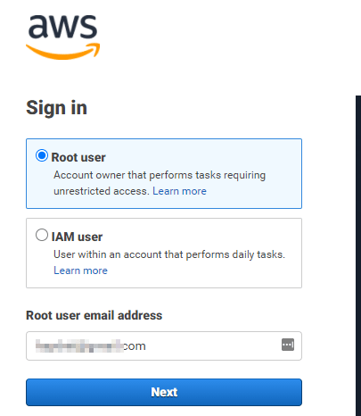

test

1) Intro to Secrets Management, leading to centralizing secrets
aka password manager
2_devops CI CD

Tasks:
- create new account in AWS (non root), give permissions for EC2 and RDS
- use new account to create EC2 and RDS 
- install vault

Vault Config:
    - configure vault to connect to RDS
     and rotate password
        config
        role 
        
        
    - enable auth userpass
    - create user

    policy  
        - user needs to be given policy to read the role
    
    maybe one root user, CRUD
    then one user with read only (requires role)
    
    
    rotating password root password.
    
    
    
<2nd harder idea for blog.>

Create PHP app with login that connects to RDS, configure it to go to vault first.
    

# Creating a Policy the hard way:
## Creating the policy
A policy will be created that allows all permissions to EC2 and AWS RDS.

This policy will then be applied to the user that we create below.

1) Sign into your AWS account.

2) Go to the Identity and Access Management section:  

3) Click Policies on the left

4) Click create policy:

Click Choose a service and then type EC2:

Click "EC2", and then under Manual Actions, select "All EC2 actions":
it should look like:

This will be giving admin (all) access to the EC2 service in AWS. We now need to add access for RDS.

At the bottom, click "Add Additional permissions".

Adding the permissions for RDS is very similar to the above. Click Choose a service and select "RDS":

Select "All RDS actions": 

These are all the permissions the policy needs. So please click "Next:Tags"