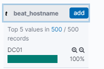

I've been working on my home lab, see (placeholder for when complete) for the full breakdown.

Now that I have my Purple Team lab setup I wanted to play around with my GoC2 and investigate which events it leaves behind.

### TL;DR: Investigating C2 traffic with Sysmon and HELK

 
# Explanation of C2
yay

// SOMETHING SOMETHING ON EC2

# Network Setup
//To fill in

**Known Network Actions**
* Connecting from DC01 ad domain admin to EC2 instance
* Generating ARP traffic
    * I don't have any network monitoring, but perhaps we can see which processes are spawned for it. or DLLs loaded
* Reading ARP traffic for a specific MAC address
* Connecting from 10a to DC01

**Known Ports**
* 10a to DC01 on port 10000
* DC01 to EC2 instance on port 9999

**Commands Executed:**
* whoami
* hostname
* netstat

nothing advanced

Example of netstat execution from win10a
* Note port 10000 to DC01, this is the port it connects on.

Example whoami command execution
* 

## HELK Baseline
Side Note:
* I might do a blog on which fields I find more helpful when moving around a SIEM such as ELK / Splunk.

Standard Kibana as shown:

Searching for today, we can see 18,626 events:

# SYSMON

## Sysmon EventID 3

The GoC2 creates a network connection. Lets see if we can identify the connection from the win10A host to DC01. This is via port 10000.

If we search Microsoft [documentation](https://docs.microsoft.com/en-us/sysinternals/downloads/sysmon) for Sysmon we find that Event ID3 is for Network Connections.

Searching through the fields we find "event_id" (in popular because I had already selected it):

Clicking the field once shows some statistics. None of them are 3.

For interest, lets click  "visualize", to give us an idea on what has been recorded. What is interesting to note is that event ID:3 is not anywhere. This is due to only the top 20 (descending) values being shown.

EventI 3 is not shown in the bottom 20 either, so clearly this is not a helpful place to look. The interesting event is not in the top 20 or bottom 20. We can filter by `event_id:3` to see how many logs there are.

So we can see 60+ logs with Eventid 3. In this situation, this is not helpful, as they could be anything. Lets look into the logs individually. We can do this because we know indicators of the Go2.

So because this is a test lab, when filtering by `event_id:3` the malware comes up instantly:

Pretending we do not know indicators for GoC2, an interesting field is `dst_port`.
Using this we can easily see which ports have been connecting. `src_port` is less "helpful" as generally it is a randomized port.
* Please note it would never be this simple doing a real investigation. The exercise here is to see what the GoC2 generates. The benefit is that we get to practice what types of logs are more important than others.

Here we have identified:  
* Port 10,000 - this is a connection from 10a to DC01 
* Port 9,999 - This is the connection from DC01 to EC2
* Port 22 - Setup for myself to admin the lab environment.

### Looking into the event log for Event ID 3:

The Sysmon looks like the below and there is a lot to unpack:  

Might be easier to view the JSON:


{
  "_index": "logs-endpoint-winevent-sysmon-2020.07.04",
  "_type": "_doc",
  "_id": "1569ab25aa96ad8892139424e26de2f47d4f90bc",
  "_version": 2,
  "_score": null,
  "_source": {
    "etl_kafka_partition": 0,
    "beat_hostname": "DC01",
    "src_host_name": "-",
    "level": "information",
    "beat_version": "7.8.0",
    "event_timezone": "UTC",
    "@version": "1",
    "src_is_ipv6": "false",
    "record_number": 12194,
    "dst_host_name": "-",
    "src_ip_addr": "172.16.2.10",
    "type": "wineventlog",
    "task": "Network connection detected (rule: NetworkConnect)",
    "rule_technique_name": "Masquerading",
    "dst_port_name": "-",
    "src_port_name": "-",
    "process_path": "c:\\users\\administrator\\desktop\\parent.exe",
    "version": 5,
    "etl_host_agent_type": "winlogbeat",
    "etl_host_agent_ephemeral_uid": "a7c3a35f-cafe-40c7-bf65-8ff7e5c87b61",
    "src_port": "53346",
    "dst_ip_rfc": "RFC_1918",
    "dst_ip_addr": "172.16.2.15",
    "process_id": "4316",
    "action": "networkconnect",
    "src_ip_public": "false",
    "meta_user_name_is_machine": "false",
    "process_guid": "BCEC0D6D-0B10-5F01-9201-000000001B00",
    "user_account": "labs\\administrator",
    "fingerprint_network_community_id": "1:nIFHzz1XOG3EZR2vZch5E6naHUo=",
    "dst_ip_public": "false",
    "user_domain": "labs",
    "event_id": 3,
    "rule_technique_id": "T1036",
    "src_ip_rfc": "RFC_1918",
    "user_name": "administrator",
    "etl_kafka_topic": "winlogbeat",
    "event_recorded_time": "2020-07-04T23:05:10.755Z",
    "src_ip_version": "4",
    "RuleName": "technique_id=T1036,technique_name=Masquerading",
    "source_name": "Microsoft-Windows-Sysmon",
    "beat_name": "DC01",
    "etl_pipeline": [
      "all-filter-0098",
      "all-add_processed_timestamp",
      "fingerprint-winlogbeats7",
      "winlogbeat_7_and_above-field_nest_cleanup",
      "winlogbeat_7_and_above-field_cleanups",
      "1500",
      "winevent-ip_conversion-SourceIp_and_DestinationIp",
      "1522",
      "winevent-sysmon-all-1531",
      "sysmon-all-extract_domain_and_user_name",
      "general_rename-various_global_options",
      "general_rename-ProcessGuid",
      "general_rename-ProcessId",
      "split-process_path-grok-process_name",
      "provider_guid-cleanup",
      "process_guid-cleanup",
      "dst_ip_addr_clean_and_public",
      "src_ip_addr_clean_and_public",
      "winevent-hostname-cleanup",
      "winevent-user_name-is-machine-account",
      "community_id_addition",
      "final-cleanup-message_field"
    ],
    "thread_id": 2444,
    "opcode": "Info",
    "dst_port": "10000",
    "process_name": "parent.exe",
    "dst_ip_version": "4",
    "z_elastic_ecs": {
      "winlog": {
        "process": {
          "thread": {}
        }
      },
      "agent": {},
      "host": {},
      "ecs": {
        "version": "1.5.0"
      },
      "event": {
        "kind": "event",
        "action": "Network connection detected (rule: NetworkConnect)",
        "code": 3,
        "provider": "Microsoft-Windows-Sysmon",
        "created": "2020-07-04T23:05:13.087Z"
      },
      "user": {
        "identifier": "S-1-5-18",
        "name": "SYSTEM",
        "domain": "NT AUTHORITY",
        "type": "User"
      },
      "log": {}
    },
    "etl_host_agent_uid": "30714c02-036a-409a-bd4c-74084417af79",
    "log_name": "Microsoft-Windows-Sysmon/Operational",
    "provider_guid": "5770385F-C22A-43E0-BF4C-06F5698FFBD9",
    "network_protocol": "tcp",
    "network_initiated": "false",
    "dst_ip_type": "private",
    "etl_kafka_offset": 158887,
    "dst_is_ipv6": "false",
    "event_original_message": "Network connection detected:\nRuleName: technique_id=T1036,technique_name=Masquerading\nUtcTime: 2020-07-04 23:05:09.673\nProcessGuid: {BCEC0D6D-0B10-5F01-9201-000000001B00}\nProcessId: 4316\nImage: C:\\Users\\Administrator\\Desktop\\parent.exe\nUser: LABS\\Administrator\nProtocol: tcp\nInitiated: false\nSourceIsIpv6: false\nSourceIp: 172.16.2.10\nSourceHostname: -\nSourcePort: 53346\nSourcePortName: -\nDestinationIsIpv6: false\nDestinationIp: 172.16.2.15\nDestinationHostname: -\nDestinationPort: 10000\nDestinationPortName: -",
    "etl_version": "2020.04.19.01",
    "event_original_time": "2020-07-04T23:05:09.673Z",
    "@timestamp": "2020-07-04T23:05:09.673Z",
    "src_ip_type": "private",
    "host_name": "dc01.lab.internal.local",
    "etl_processed_time": "2020-07-04T23:05:22.845Z",
    "etl_kafka_time": 1593903910755
  },
  "fields": {
    "@timestamp": [
      "2020-07-04T23:05:09.673Z"
    ],
    "etl_processed_time": [
      "2020-07-04T23:05:22.845Z"
    ]
  },
  "sort": [
    1593903909673
  ]
}


Quite a read, but gives you an idea of what is included and what can be searched on.

Important information
* `process_name` = parent.exe
* `network_protocol` =  TCP
* `src_ip_address` = 172.16.2.10 (win10a)
* `dst_ip_addr` = 172.16.2.15 (DC01)

So this event log, shows that an executable called parent.exe connected via TCP from win10a to DC01. From here we could pivot to Sysmon Event ID 1 and search the process. But lets continue.

The `event_original_message` is what you would see within event viewer, or put another way, the message that is default before being parsed.

## Windows Event Viewer
If these logs were not forwarded to HELK, one would have to search the Event Viewer. This is not scalable:

Clearly the Kibana view is much nicer to work with than Windows event viewer:  

No Sysmon == no events
win10a didn't have Sysmon configured, missing installation. It seemed to be missing any tracking of port 10000.

Searching for 100000 does not find any network connection related logs:

# Sysmon Event ID 1: Process Creation
Sysmon ID 1 logs information on process creation:  

Using the identified process name above of `parent.exe` we can find more information. A query like this:

This bring up our suspected process:

The `event_original_message` is:

Important information found here:  
* Hashes - we can search virus total to see if this is known, or for any more potential information
* The User and privileges that this was launched with
* The parent image that launched parent.exe - in this case this was simply launached via cmd and not powershell

This C2 "parent" brokers communication between the admin itnerface and the child malware launched, as such the process creation only shows `parent.exe` being executed on the command line:

## A Gap in Visiblity
We have been able to search the parent malware, but we are unable to identify the child malware. This is because the configuration for Sysmon, windows auditing and logging is not pushed down to win10a.

We can see this via the hostnames found in Kibana:

 
 
 

=== IN progress / Ideas === ===

IMP HASHES
harder to change
overall hash can change by changing 1 bit

